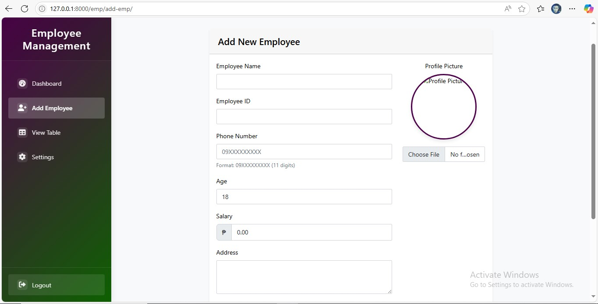
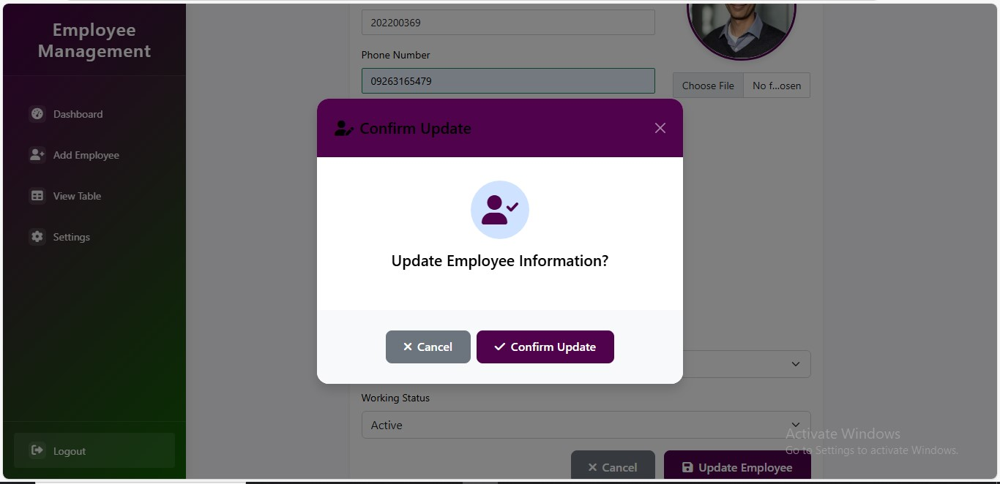

# Employee Management System

A modern, responsive Employee Management System built with Django, featuring a beautiful UI and comprehensive employee management capabilities. This system allows organizations to efficiently manage their employee data, track working status, and handle departmental assignments through an intuitive interface.


## 🌟 Features

### 👥 Employee Management
- Add, update, and delete employee records with confirmation dialogs
- Comprehensive employee profiles with photo upload and preview
- Track employee status (Active/Inactive) with visual indicators
- Dynamic department assignment with dropdown selection
- Salary management with currency formatting
- Contact information tracking with phone number validation
- Age verification with min/max constraints

### 🎨 Modern UI/UX
- Responsive design optimized for desktop and mobile devices
- Sliding sidebar navigation with collapsible menu
- Interactive data tables with real-time search
- Multi-filter system (department, status, search)
- Professional confirmation dialogs for all actions
- Customizable color schemes and themes
- Font Awesome icons for enhanced visual experience
- Form validation with instant feedback

### ⚙️ System Features
- Secure authentication system with session management
- User registration with email validation
- Modern navigation interface with active state indicators
- Role-based access control for different user levels
- Configurable system settings through admin panel
- Comprehensive audit trail for all changes
- Data validation and sanitization
- Error handling with user-friendly messages
- Success notifications with auto-dismiss
- Unsaved changes detection and warnings

### 📊 Dashboard Features
- Employee statistics and overview
- Department-wise distribution
- Active/Inactive employee status tracking
- Quick action buttons for common tasks
- Recent activity monitoring
- Performance metrics visualization

### 🔐 Authentication Features
- Modern login interface with navigation bar
- User registration system with validation
- Compact and user-friendly registration form
- Active state indicators in navigation
- Secure password management
- Session handling and user tracking

## 🚀 Getting Started

### Prerequisites
- Python 3.8 or higher
- pip (Python package manager)
- MySQL 8.0 or higher
- MySQL service running on localhost:3306
- Virtual environment (recommended)
- Web browser (Chrome/Firefox/Safari)

### Installation

1. Clone the repository
```bash
git clone https://github.com/RonnieToribio/Employee-Management-System.git
cd Employee-Management-System
```

2. Create and activate virtual environment
```bash
# Windows
python -m venv venv
venv\Scripts\activate

# Linux/Mac
python3 -m venv venv
source venv/bin/activate
```

3. Install dependencies
```bash
pip install -r requirements.txt
```

4. Configure environment variables
```bash
# Create .env file in project root
SECRET_KEY=your_secret_key
DEBUG=True
ALLOWED_HOSTS=localhost,127.0.0.1

# Database settings
DB_NAME=emp
DB_USER=root
DB_PASSWORD=your_mysql_password
DB_HOST=localhost
DB_PORT=3306
```

5. Create MySQL database
```bash
# Log into MySQL as root
mysql -u root -p

# Create the database
CREATE DATABASE emp;
```

6. Run migrations
```bash
python manage.py makemigrations
python manage.py migrate
```

7. Create superuser
```bash
python manage.py createsuperuser
```

8. Run the development server
```bash
python manage.py runserver
```

Visit `http://127.0.0.1:8000` in your browser and login with your superuser credentials.

## 📱 Key Features Screenshots

### List view with search


### Add Form


### Edit Form


### Delete Confirmation


### Other Features


### Settings Panel

- System configuration options
- Theme customization

## 🛠️ Technology Stack

### Backend
- Django 4.0.4 (Python Web Framework)
- Python 3.8+ (Programming Language)
- MySQL 8.0 (Primary Database)

### Frontend
- HTML5 (Structure)
- CSS3 (Styling)
- JavaScript (Interactivity)
- Bootstrap 5.2.2 (CSS Framework)
- Font Awesome 6.0.0 (Icons)

### Additional Libraries
- Pillow (Python Imaging Library) - Image processing
- Django Crispy Forms - Form rendering
- Django environ - Environment variables management

## 📋 Project Structure
```
Employee-Management-System/
├── emp/                    # Main application directory
│   ├── migrations/         # Database migrations
│   ├── templates/         # HTML templates
│   │   ├── emp/          # Employee management templates
│   │   └── auth/         # Authentication templates
│   ├── static/           # Static assets
│   │   ├── css/         # Stylesheets
│   │   ├── js/          # JavaScript files
│   │   └── img/         # Images
│   ├── models.py         # Database models
│   ├── views.py          # View logic
│   ├── urls.py           # URL configurations
│   └── admin.py          # Admin interface setup
├── media/                 # User-uploaded files
│   └── profile_pics/     # Employee profile pictures
├── templates/             # Base templates
├── manage.py             # Django management script
├── requirements.txt      # Project dependencies
└── README.md            # Project documentation
```

## 🔐 Security Features
- CSRF Protection against cross-site request forgery
- Session Security with timeout and rotation
- Secure Password Hashing using Django's auth system
- Form Validation and Sanitization
- XSS Prevention measures
- Secure File Upload handling
- SQL Injection Protection
- User Authentication and Authorization

## 🤝 Contributing
1. Fork the repository
2. Create your feature branch (`git checkout -b feature/AmazingFeature`)
3. Commit your changes (`git commit -m 'Add some AmazingFeature'`)
4. Push to the branch (`git push origin feature/AmazingFeature`)
5. Open a Pull Request

## 📄 License
This project is licensed under the MIT License - see the [LICENSE](LICENSE) file for details.

## 👏 Acknowledgments
- Django Documentation for excellent resources
- Bootstrap Team for the responsive framework
- Font Awesome for beautiful icons
- Django Community for support and inspiration
- All contributors who help improve this project

## 📞 Contact
Ronnie Toribio - [@RonnieToribio](https://twitter.com/RonnieToribio) - ronnieyoung224@gmail.com

Project Link: [https://github.com/RonnieToribio/Employee-Management-System](https://github.com/RonnieToribio/Employee-Management-System)

---
⭐️ If you find this project helpful, please consider giving it a star! Your support helps make it better. 
